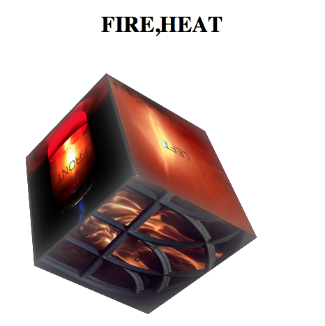

ng-cube
======
[](https://travis-ci.org/angularjs-de/ng-cube)

This is an project based on an example for an german [article](http://angularjs-de.github.io/java-mag-angularjs-article/).



## Demo

[View Demo](http://angularjs-de.github.io/java-mag-angularjs-article/examples/cube11/#/fire,heat)


## Usage
May you want to add or remove cubes dynamically like this:
```js
angular.module("cubeApp")
    .controller("CubeListCtrl", function ($scope) {
      $scope.cubes = [];

      $scope.addCube = function (xValue, yValue, zValue, tagValue) {
        $scope.cubes.push({x: xValue, y: yValue, z: zValue, tag: tagValue});
      }

      $scope.removeCube = function (index) {
        $scope.cubes.splice(index, 1);
      }
    });
```
```html
<h1>Cubes</h1>
<header ng-init="x=0;y=0;z=0">
    <h2>Add new Cube</h2>
    <input type="range" ng-model="x" min="0" max="360" step="1"/>
    <input type="range" ng-model="y" min="0" max="360" step="1"/>
    <input type="range" ng-model="z" min="0" max="360" step="1"/>
    <input type="text" ng-model="tag" placeholder="Tags (comma-separated)"/>
    <button class="addCube" ng-click="addCube(x,y,z,tag)">add Cube</button>
</header>
<section>
    <h2>Cube List ({{cubes.length}})</h2>
    <ul>
        <li ng-repeat="cube in cubes">
            <cube init-x="{{cube.x}}" init-y="{{cube.y}}" init-z="{{cube.z}}" tag="{{cube.tag}}"></cube>
            <button class="removeCube" ng-click="removeCube($index)">remove this cube</button>
            <a ng-href="#/{{cube.tag}}" target="_blank">Open {{cube.tag}} in a new window</a>
        </li>
    </ul>
</section>

```

## Config
You'll need an [API Key](http://www.flickr.com/services/api/misc.api_keys.html).
```js
angular.module("angularjsde.cube")
    .config(function (flickrProvider) {
        flickrProvider.apiKey("4e0e99bf242015aee01bffea1efff314");
    });
```

## Contact

[Twitter](https://twitter.com/angularjs_de)


[](https://bitdeli.com/free "Bitdeli Badge")

